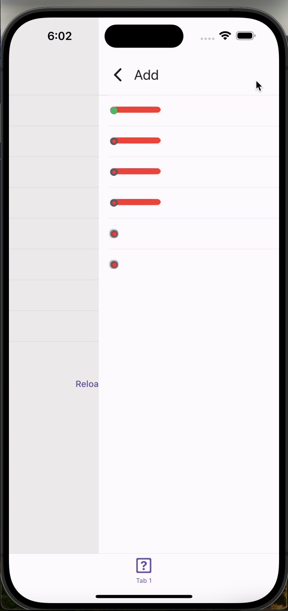
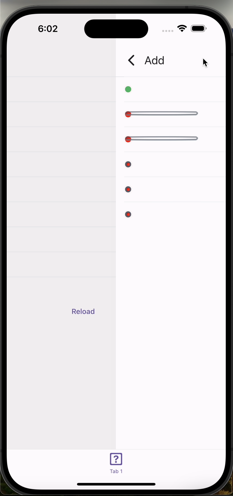

# README

This is a sample repository, which reproduces rendering issue of elements, which use `border` style.

https://github.com/jankosecki/rn-border-issue-repro/assets/41573247/f71f1aa7-37ad-44bd-9c7b-ec11d1532a30

https://github.com/jankosecki/rn-border-issue-repro/assets/41573247/96c4b7ac-1800-4653-9345-e278afec41cc

